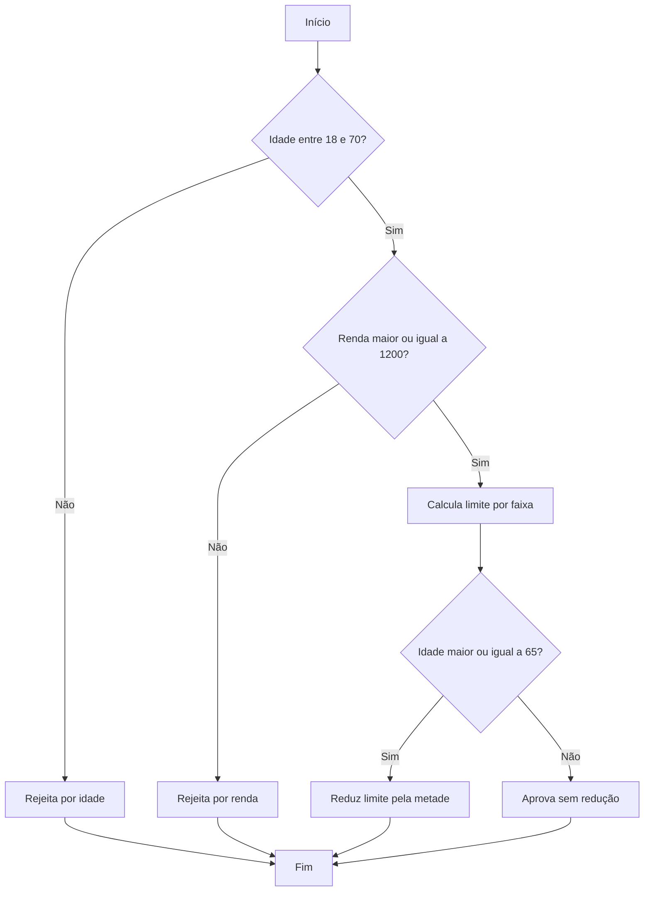

# Casos de teste — Projeto de Teste B01A02

**Alunos:** Lucas Betim Nobre de Oliveira e Rafael Schultz

## Casos de teste

| ID | Requisito | Técnica | Entrada | Resultado esperado | Resultado obtido | Situação |
|---|---|---|---|---|---|---|
| CT-01 | RF-01 | BVA | `avaliarPedidoEmprestimo(17, 2000)` | rejeitado por idade | rejeitado por idade | Passou |
| CT-02 | RF-01 | BVA | `avaliarPedidoEmprestimo(18, 1200)` | aprovado, limite 2400 | rejeitado por renda | Falhou |
| CT-03 | RF-01 | BVA | `avaliarPedidoEmprestimo(70, 3000)` | aprovado, limite 4500 | aprovado, limite 4500 | Passou |
| CT-04 | RF-01 | BVA | `avaliarPedidoEmprestimo(71, 2000)` | rejeitado por idade | rejeitado por idade | Passou |
| CT-05 | RF-01 | BVA | `avaliarPedidoEmprestimo(30, 2999.99)` | limite 5999.98 | limite 5999.98 | Passou |
| CT-06 | RF-01 | BVA | `avaliarPedidoEmprestimo(30, 3000)` | limite 9000 | limite 9000 | Passou |
| CT-07 | RF-01 | BVA | `avaliarPedidoEmprestimo(30, 7999.99)` | limite 23999.97 | limite 23999.97 | Passou |
| CT-08 | RF-01 | BVA | `avaliarPedidoEmprestimo(30, 8000)` | limite 40000 | limite 32000 | Falhou |
| CT-09 | RF-01 | Teste de condição | `avaliarPedidoEmprestimo(65, 4500)` | limite 6750 | limite 6750 | Passou |
| CT-10 | RF-02 | BVA | `abrir(0)` | saldo 0 | saldo 0 | Passou |
| CT-11 | RF-02..RF-07/RNF-01 | OO/fluxo de dados | `abrir(100) -> depositar(50) -> sacar(30) -> juros(10) -> fechar()` | saldo final 132 | saldo final 132 | Passou |
| CT-12 | RF-04 | BVA | `abrir(100) -> sacar(100)` | saldo 0 | saldo 0 | Passou |
| CT-13 | RF-05 | BVA | `abrir(100) -> juros(0)` | saldo 100 | saldo 100 | Passou |
| CT-14 | RF-05 | BVA | `abrir(100) -> juros(100)` | saldo 200 | saldo 200 | Passou |
| CT-15 | RF-05 | Particionamento de equivalência | `abrir(100) -> juros(101)` | erro `TAXA_INVALIDA` | operação aceita, saldo 201 | Falhou |
| CT-16 | RF-02 | Particionamento de equivalência | `abrir(-1)` | erro `SALDO_INICIAL_INVALIDO` | erro esperado | Passou |
| CT-17 | RF-06 | Máquina de estados | operações antes de `abrir()` | erros de carteira fechada | erros esperados | Passou |
| CT-18 | RF-08 | Teste de componente/interface | `gerarMensagemNotificacao(avaliarPedidoEmprestimo(17, 2000))` | mensagem de rejeição | erro `RESULTADO_INVALIDO` | Falhou |
| CT-19 | RF-08 | Teste de componente/interface | notificador com resultado aprovado real | mensagem com limite R$ 13500.00 | mensagem esperada | Passou |
| CT-20 | RF-08 | Teste de condição | aprovação sem `limiteCredito` | erro `RESULTADO_INVALIDO` | erro esperado | Passou |
| CT-21 | RF-09 | Teste de sistema/cenário | `node index.js emprestimo 45 4500` | aprovação, limite R$ 13500.00, código 0 | resultado esperado | Passou |
| CT-22 | RF-09 | Teste de sistema/interface | `node index.js emprestimo 17 2000` | rejeição e código 0 | erro e código 1 | Falhou |

## Resultado da execução

Comando executado: `npm.cmd test`

- Total: 31 testes
- Aprovados: 26
- Falhas: 5
- Casos com falha: CT-02, CT-08, CT-15, CT-18 e CT-22

As cinco falhas correspondem aos defeitos descritos na seção abaixo.

## Defeitos encontrados

| Caso(s) | Módulo | Requisito violado | Descrição do defeito |
|---|---|---|---|
| CT-02 | `src/emprestimo.js` | RF-01 | A renda mínima de R$ 1.200,00 deveria ser aceita, mas a implementação usa `rendaMensal <= 1200` e rejeita esse valor. |
| CT-08 | `src/emprestimo.js` | RF-01 | A faixa de renda a partir de R$ 8.000,00 deveria usar multiplicador 5, mas `multiplicadorPorFaixa` retorna 4. |
| CT-15 | `src/carteira.js` | RF-05 | A taxa deve estar entre 0% e 100%, mas `aplicarJuros` não rejeita valores maiores que 100%. |
| CT-18, CT-22 | `src/notificador.js`/`index.js` | RF-08/RF-09 | O notificador rejeita o motivo codificado `IDADE_FORA_DO_LIMITE` produzido pelo empréstimo; por isso a CLI termina com erro em vez de exibir a rejeição. |

## Grafo de fluxo (opcional)

Função analisada: `avaliarPedidoEmprestimo`
Complexidade ciclomática: `V(G) = 4` — como foi calculada: `1` (base) + `1` para a validação de idade + `1` para a validação de renda + `1` para a redução por idade.
Caminhos independentes:
1. Idade inválida -> rejeição por idade.
2. Idade válida, renda insuficiente -> rejeição por renda.
3. Idade válida, renda suficiente, idade menor que 65 -> cálculo e aprovação sem redução.
4. Idade válida, renda suficiente, idade a partir de 65 -> cálculo, redução e aprovação.

